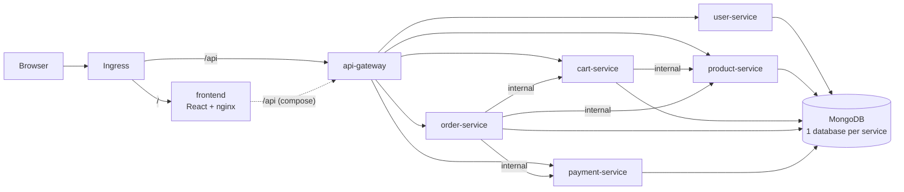

# ShopVerse: Microservices E-Commerce Platform

ShopVerse is a Flipkart/Amazon-style shopping app built as a set of microservices. It has a React storefront, an API gateway, five Node.js domain services and MongoDB. Every component ships as its own container image on GHCR. A Helm chart deploys it to Kubernetes, and Argo CD manages that deployment through GitOps.


## Features

- **Storefront:** home page with categories, banners and featured shelves. Product listing with search, category, brand and price filters, sorting and pagination. Product detail page, cart, checkout with saved addresses, order tracking and cancellation.
- **Auth:** register and log in with JWT, plus customer and admin roles.
- **Admin dashboard:** move orders along the delivery pipeline and add products.
- **Checkout saga:** the order service reserves stock, charges the payment, saves the order and clears the cart. If a step fails, the earlier steps are undone (stock is released and the payment refunded).
- **Mock payment gateway:** supports UPI, card, net banking and COD. Card `4000 0000 0000 0002` is always declined. COD payments are captured when the order is delivered.
- **Production-minded setup:** non-root containers with a read-only filesystem, health and readiness probes, HPA, PDB, NetworkPolicies, JSON logs and graceful shutdown.

## Architecture



| Service | Path | Responsibility | Database |
|---|---|---|---|
| `frontend` | `/` | React SPA served by unprivileged nginx | – |
| `api-gateway` | `/api/*` | Routing, rate limiting, CORS. Never exposes `/internal/*` | – |
| `user-service` | `/api/users` | Register/login (JWT), profile, addresses, admin seed | `shopverse_users` |
| `product-service` | `/api/products` | Catalog, search and filters, categories, stock reserve/release | `shopverse_products` |
| `cart-service` | `/api/cart` | Per-user cart priced with live product data | `shopverse_carts` |
| `order-service` | `/api/orders` | Checkout saga, order history, cancel, admin status updates | `shopverse_orders` |
| `payment-service` | `/api/payments` | Mock payment processor (charge, refund, capture) | `shopverse_payments` |

Services call each other on `/internal/*` routes. Those calls are authenticated with a shared `INTERNAL_TOKEN`, are not routed by the gateway, and in Kubernetes are also restricted by NetworkPolicy.

## Repository layout

```
frontend/                  React + Vite storefront, nginx Dockerfile
services/<name>/           Node.js microservices (each has its own Dockerfile)
docker-compose.yml         Full local stack
helm/shopverse/            Helm chart (all services + MongoDB + ingress + netpol)
gitops/
  argocd/                  Argo CD AppProject, root app (app-of-apps), per-env Applications
  environments/dev|prod/   Per-environment Helm values (image tags live here)
.github/workflows/         CI (build/push to GHCR + GitOps bump) and prod promotion
Makefile                   Manual build/push helpers
```

## 1. Run locally

```bash
docker compose up --build        # or: make up
```

- Storefront: http://localhost:3000
- API gateway: http://localhost:8080/api/products
- Admin login: `admin@shopverse.local` / `admin123`

On first start the product service seeds 40 demo products across 9 categories.

To work on the frontend with hot reload, keep the compose stack running and run `cd frontend && npm install && npm run dev`, then open http://localhost:5173.

## 2. Build and push images to GHCR

### Automatically (recommended)

`.github/workflows/ci.yaml` runs on every push to `main` and does the following:

1. Installs and syntax-checks every service, builds the frontend, and lints and renders the Helm chart for every environment.
2. Builds all 7 images for `linux/amd64` and `linux/arm64` and pushes them to:
   ```
   ghcr.io/shaggydesai/microservice-app/<service>:sha-<commit>   (+ :latest on main, :X.Y.Z on v* tags)
   ```
3. **GitOps step:** writes the new `sha-<commit>` tag into `gitops/environments/dev/values.yaml` and commits it with `[skip ci]`. Argo CD sees the commit and rolls out dev.

The workflow uses the built-in `GITHUB_TOKEN`, so you don't need to add any secrets. If `main` is branch-protected, allow `github-actions[bot]` to push to it, or change the deploy-dev job to open a PR instead.

### Manually

```bash
echo $GHCR_PAT | docker login ghcr.io -u <github-user> --password-stdin   # PAT with write:packages
make push TAG=v1.0.0
```

> GHCR packages are **private** by default. Either make each package public (GitHub → Packages → Package settings → Change visibility) or create a pull secret in each namespace and set `global.imagePullSecrets`:
> ```bash
> kubectl -n shopverse-dev create secret docker-registry ghcr-pull \
>   --docker-server=ghcr.io --docker-username=<github-user> --docker-password=<PAT with read:packages>
> ```
> ```yaml
> global:
>   imagePullSecrets: [{ name: ghcr-pull }]
> ```

## 3. Deploy with Helm (without GitOps)

Prerequisites: a Kubernetes cluster and an ingress controller (the chart defaults to ingress-nginx).

```bash
helm upgrade --install shopverse helm/shopverse \
  -n shopverse-dev --create-namespace \
  -f gitops/environments/dev/values.yaml \
  --set global.imageTag=sha-abc1234

helm test shopverse -n shopverse-dev
# Without a DNS record for the ingress host:
kubectl -n shopverse-dev port-forward svc/shopverse-frontend 3000:8080
```

Main chart values (see `helm/shopverse/values.yaml`):

| Key | Purpose |
|---|---|
| `global.imageRegistry` / `global.imageTag` | Image location and tag for all services |
| `services.<name>.tag` | Pin a single service to a different tag |
| `serviceDefaults.*` | Replicas, resources, HPA, PDB applied to every service |
| `secrets.existingSecret` | Use an externally managed Secret (recommended for prod) |
| `mongodb.enabled` / `mongodb.external.host` | In-cluster MongoDB StatefulSet or a managed MongoDB |
| `ingress.*` | Host, class, TLS |
| `networkPolicy.enabled` | Lock down MongoDB and the internal services |

## 4. GitOps with Argo CD

```
  git push ──► CI builds & pushes images ──► CI commits new tag to gitops/environments/dev
                                                      │
                     Argo CD watches the repo ◄───────┘──► syncs shopverse-dev automatically

  "Promote to prod" workflow ──► PR changing gitops/environments/prod ──► merge ──► Argo CD syncs shopverse-prod
```

### One-time setup

```bash
# 1. Install Argo CD
kubectl create namespace argocd
kubectl apply -n argocd -f https://raw.githubusercontent.com/argoproj/argo-cd/stable/manifests/install.yaml

# 2. (Private repo only) give Argo CD read access to this repository
argocd repo add https://github.com/Shaggydesai/MicroService-App.git --username <user> --password <PAT>

# 3. Production secret: create it before the first prod sync (use Sealed Secrets / External Secrets for real setups)
kubectl create namespace shopverse-prod
kubectl -n shopverse-prod create secret generic shopverse-secrets \
  --from-literal=jwt-secret="$(openssl rand -hex 32)" \
  --from-literal=internal-token="$(openssl rand -hex 32)" \
  --from-literal=admin-email=admin@yourdomain.com \
  --from-literal=admin-password="$(openssl rand -base64 18)" \
  --from-literal=mongo-username=shopverse \
  --from-literal=mongo-password="$(openssl rand -hex 24)"

# 4. Bootstrap the app-of-apps. Everything else is managed from Git after this.
kubectl apply -f gitops/argocd/root-app.yaml
```

The root app syncs `gitops/argocd/`, which contains the `shopverse` AppProject and one Application per environment:

| Application | Namespace | Values | How it changes |
|---|---|---|---|
| `shopverse-dev` | `shopverse-dev` | `gitops/environments/dev/values.yaml` | CI bumps the tag on every push to `main` |
| `shopverse-prod` | `shopverse-prod` | `gitops/environments/prod/values.yaml` | Merging a PR from the **Promote to prod** workflow |

Both Applications use automated sync with `prune` and `selfHeal`, so the cluster always matches Git. A manual `kubectl edit` gets reverted, and the way to roll back is `git revert`.

### Promoting to production

Go to **Actions → Promote to prod → Run workflow**. Leave the tag empty to promote whatever is running in dev, or enter a specific tag. The workflow checks that every image exists in GHCR and then opens a PR. Merging that PR is the deployment.

For the workflow to open PRs, enable **Settings → Actions → General → Allow GitHub Actions to create and approve pull requests**.

### Adding an environment

Copy `gitops/environments/dev` to `gitops/environments/staging`, copy `gitops/argocd/apps/shopverse-dev.yaml` to `shopverse-staging.yaml` (and update its name, namespace and values path), and add the new namespace to `gitops/argocd/project.yaml`. Then commit, and Argo CD picks it up.

## API quick reference

All endpoints are under `/api`. Endpoints marked 🔒 need `Authorization: Bearer <token>`.

| Method | Path | Notes |
|---|---|---|
| POST | `/users/register`, `/users/login` | Returns `{ token, user }` |
| GET/PUT | `/users/me` 🔒 | Profile |
| POST/DELETE | `/users/me/addresses[/:id]` 🔒 | Saved addresses |
| GET | `/products?q=&category=&brand=&minPrice=&maxPrice=&sort=&page=&limit=` | `sort`: relevance, price-asc, price-desc, rating, newest |
| GET | `/products/categories`, `/products/brands`, `/products/:id` | `:id` can be an id or a slug |
| POST/PUT/DELETE | `/products[/:id]` 🔒 admin | Manage catalog |
| GET/DELETE | `/cart` 🔒 | Cart with price summary |
| POST | `/cart/items` 🔒 | `{ productId, quantity }` |
| PATCH/DELETE | `/cart/items/:productId` 🔒 | Update quantity or remove |
| POST | `/orders` 🔒 | `{ shippingAddress, paymentMethod: UPI\|CARD\|NETBANKING\|COD, paymentDetails }` |
| GET | `/orders`, `/orders/:orderNumber` 🔒 | History and detail |
| POST | `/orders/:orderNumber/cancel` 🔒 | Releases stock and refunds the payment |
| GET | `/orders/admin/all` 🔒 admin | All orders |
| PATCH | `/orders/:orderNumber/status` 🔒 admin | `PACKED → SHIPPED → OUT_FOR_DELIVERY → DELIVERED` |
| GET | `/payments` 🔒 | Payment history |

Every service exposes `/healthz` (liveness) and `/readyz` (MongoDB connected).

## Configuration (environment variables)

| Variable | Used by | Description |
|---|---|---|
| `MONGO_URI` | all domain services | MongoDB connection string |
| `JWT_SECRET` | all domain services | Signs and verifies user tokens |
| `INTERNAL_TOKEN` | all domain services | Shared secret for `/internal/*` calls |
| `*_SERVICE_URL` | gateway, cart, order | Upstream service URLs |
| `ADMIN_EMAIL` / `ADMIN_PASSWORD` | user-service | Bootstrap admin account |
| `SEED_DATA` | product-service | Seed the demo catalog when the database is empty (default `true`) |
| `FREE_DELIVERY_ABOVE` / `DELIVERY_FEE` | order-service | Delivery pricing |
| `RATE_LIMIT_PER_MINUTE` / `CORS_ORIGINS` | api-gateway | Edge controls |
| `API_GATEWAY_URL` / `NGINX_RESOLVER` | frontend | Where nginx proxies `/api` |

> `services/*/src/lib.js` is shared helper code. It is copied into every service on purpose, so each image builds from its own folder. If you change it, change all the copies.
