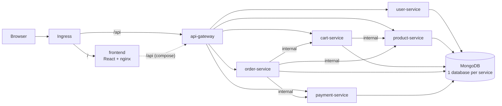

# ShopVerse: Microservices E-Commerce Platform

ShopVerse is a Flipkart/Amazon-style shopping app built as a set of microservices. It has a React storefront, an API gateway, five Node.js domain services and MongoDB. Every component ships as its own container image on GHCR. A Helm chart deploys it to Kubernetes, and Argo CD manages that deployment through GitOps.

Argo CD also manages a cluster platform layer:

| Concern | Component |
|---|---|
| Load balancing (bare metal) | **MetalLB** gives ingress-nginx an external IP |
| TLS | **cert-manager** with a private CA for `*.shopverse.local` and Let's Encrypt for real domains |
| Secrets | **HashiCorp Vault** holds the secrets, and the **External Secrets Operator** syncs them into Kubernetes |
| Metrics and alerts | **Prometheus**, Alertmanager and **Grafana** (kube-prometheus-stack) |
| Logs | **Loki**, fed by Grafana Alloy |
| Continuous profiling | **Pyroscope**, fed by the `@pyroscope/nodejs` SDK in every service |


## Features

- **Storefront:** home page with categories, banners and featured shelves. Product listing with search, category, brand and price filters, sorting and pagination. Product detail page, cart, checkout with saved addresses, order tracking and cancellation.
- **Auth:** register and log in with JWT, plus customer and admin roles.
- **Admin dashboard:** move orders along the delivery pipeline and add products.
- **Checkout saga:** the order service reserves stock, charges the payment, saves the order and clears the cart. If a step fails, the earlier steps are undone (stock is released and the payment refunded).
- **Mock payment gateway:** supports UPI, card, net banking and COD. Card `4000 0000 0000 0002` is always declined. COD payments are captured when the order is delivered.
- **Production-minded setup:** non-root containers with a read-only filesystem, health and readiness probes, HPA, PDB, NetworkPolicies, JSON logs and graceful shutdown.
- **Observability built in:** every service exposes Prometheus `/metrics` (RED metrics, Node.js runtime and business KPIs such as orders, revenue and payment declines), writes JSON logs for Loki and pushes CPU/wall-time profiles to Pyroscope. A ready-made Grafana dashboard and alert rules ship with the chart.

## Architecture



| Service | Path | Responsibility | Database |
|---|---|---|---|
| `frontend` | `/` | React SPA served by unprivileged nginx | – |
| `api-gateway` | `/api/*` | Routing, rate limiting, CORS. Never exposes `/internal/*` | – |
| `user-service` | `/api/users` | Register/login (JWT), profile, addresses, admin seed | `shopverse_users` |
| `product-service` | `/api/products` | Catalog, search and filters, categories, stock reserve/release | `shopverse_products` |
| `cart-service` | `/api/cart` | Per-user cart priced with live product data | `shopverse_carts` |
| `order-service` | `/api/orders` | Checkout saga, order history, cancel, admin status updates | `shopverse_orders` |
| `payment-service` | `/api/payments` | Mock payment processor (charge, refund, capture) | `shopverse_payments` |

Services call each other on `/internal/*` routes. Those calls are authenticated with a shared `INTERNAL_TOKEN`, are not routed by the gateway, and in Kubernetes are also restricted by NetworkPolicy.

## Repository layout

```
frontend/                  React + Vite storefront, nginx Dockerfile
services/<name>/           Node.js microservices (each has its own Dockerfile)
docker-compose.yml         Full local stack
helm/shopverse/            Helm chart (services, MongoDB, ingress, netpol, ExternalSecret,
                           ServiceMonitor, PrometheusRule, Grafana dashboard)
gitops/
  argocd/                  Argo CD AppProjects, root app (app-of-apps), per-env Applications
  argocd/platform/         One Argo CD Application per platform component (sync-wave ordered)
  platform/values/         Helm values for each platform component
  platform/manifests/      MetalLB pool, ClusterIssuers, ClusterSecretStore, Grafana admin secret
  environments/dev|prod/   Per-environment Helm values (image tags live here)
observability/             Prometheus/Grafana/Loki/Alloy config for the local compose profile
scripts/vault-bootstrap.sh Initialise/unseal Vault, configure ESO access, seed secrets
renovate.json              Keeps pinned chart and npm versions up to date
.github/workflows/         CI (build/push to GHCR + GitOps bump) and prod promotion
Makefile                   Manual build/push helpers
```

## 1. Run locally

```bash
docker compose up --build        # or: make up
```

- Storefront: http://localhost:3000
- API gateway: http://localhost:8080/api/products
- Admin login: `admin@shopverse.local` / `admin123`

On first start the product service seeds 40 demo products across 9 categories.

### With the observability stack

```bash
PYROSCOPE_SERVER_ADDRESS=http://pyroscope:4040 docker compose --profile observability up --build
```

Grafana runs at http://localhost:3001 with anonymous admin access, and the **ShopVerse / Overview** dashboard is already provisioned. Prometheus is at :9090, Loki at :3100 and Pyroscope at :4040. Alloy collects the container logs through the Docker socket.

To work on the frontend with hot reload, keep the compose stack running and run `cd frontend && npm install && npm run dev`, then open http://localhost:5173.

## 2. Build and push images to GHCR

### Automatically (recommended)

`.github/workflows/ci.yaml` runs on every push to `main` and does the following:

1. Installs and syntax-checks every service, builds the frontend, and lints and renders the Helm chart for every environment.
2. Builds all 7 images for `linux/amd64` and `linux/arm64` and pushes them to:
   ```
   ghcr.io/shaggydesai/microservice-app/<service>:sha-<commit>   (+ :latest on main, :X.Y.Z on v* tags)
   ```
3. **GitOps step:** writes the new `sha-<commit>` tag into `gitops/environments/dev/values.yaml` and commits it with `[skip ci]`. Argo CD sees the commit and rolls out dev.

The workflow uses the built-in `GITHUB_TOKEN`, so you don't need to add any secrets. If `main` is branch-protected, allow `github-actions[bot]` to push to it, or change the deploy-dev job to open a PR instead.

### Manually

```bash
echo $GHCR_PAT | docker login ghcr.io -u <github-user> --password-stdin   # PAT with write:packages
make push TAG=v1.0.0
```

> GHCR packages are **private** by default. Either make each package public (GitHub → Packages → Package settings → Change visibility) or create a pull secret in each namespace and set `global.imagePullSecrets`:
> ```bash
> kubectl -n shopverse-dev create secret docker-registry ghcr-pull \
>   --docker-server=ghcr.io --docker-username=<github-user> --docker-password=<PAT with read:packages>
> ```
> ```yaml
> global:
>   imagePullSecrets: [{ name: ghcr-pull }]
> ```

## 3. Deploy with Helm (without GitOps)

Prerequisites: a Kubernetes cluster and an ingress controller (the chart defaults to ingress-nginx).

```bash
helm upgrade --install shopverse helm/shopverse \
  -n shopverse-dev --create-namespace \
  -f gitops/environments/dev/values.yaml \
  --set global.imageTag=sha-abc1234

helm test shopverse -n shopverse-dev
# Without a DNS record for the ingress host:
kubectl -n shopverse-dev port-forward svc/shopverse-frontend 3000:8080
```

Main chart values (see `helm/shopverse/values.yaml`):

| Key | Purpose |
|---|---|
| `global.imageRegistry` / `global.imageTag` | Image location and tag for all services |
| `services.<name>.tag` | Pin a single service to a different tag |
| `serviceDefaults.*` | Replicas, resources, HPA, PDB applied to every service |
| `secrets.existingSecret` | Use an externally managed Secret (recommended for prod) |
| `mongodb.enabled` / `mongodb.external.host` | In-cluster MongoDB StatefulSet or a managed MongoDB |
| `ingress.*` | Host, class, TLS |
| `networkPolicy.enabled` | Lock down MongoDB and the internal services |

## 4. GitOps with Argo CD

```
  git push ──► CI builds & pushes images ──► CI commits new tag to gitops/environments/dev
                                                      │
                     Argo CD watches the repo ◄───────┘──► syncs shopverse-dev automatically

  "Promote to prod" workflow ──► PR changing gitops/environments/prod ──► merge ──► Argo CD syncs shopverse-prod
```

### One-time setup

```bash
# 1. Install Argo CD
kubectl create namespace argocd
kubectl apply -n argocd -f https://raw.githubusercontent.com/argoproj/argo-cd/stable/manifests/install.yaml

# 2. (Private repo only) give Argo CD read access to this repository
argocd repo add https://github.com/Shaggydesai/MicroService-App.git --username <user> --password <PAT>

# 3. Respect sync waves between Applications (platform before apps). See section 5.
kubectl -n argocd patch configmap argocd-cm --type merge -p '{"data":{"resource.customizations.health.argoproj.io_Application":"hs = {}\nhs.status = \"Progressing\"\nhs.message = \"\"\nif obj.status ~= nil and obj.status.health ~= nil then\n  hs.status = obj.status.health.status\n  if obj.status.health.message ~= nil then hs.message = obj.status.health.message end\nend\nreturn hs\n"}}'

# 4. Bootstrap the app-of-apps. Everything else is managed from Git after this.
kubectl apply -f gitops/argocd/root-app.yaml

# 5. Once the vault-0 pod is Running, initialise Vault and seed all secrets (one time)
scripts/vault-bootstrap.sh
```

The root app syncs `gitops/argocd/`. That directory holds the `shopverse` and `platform` AppProjects, the platform Applications (section 5) and one Application per environment:

| Application | Namespace | Values | How it changes |
|---|---|---|---|
| `shopverse-dev` | `shopverse-dev` | `gitops/environments/dev/values.yaml` | CI bumps the tag on every push to `main` |
| `shopverse-prod` | `shopverse-prod` | `gitops/environments/prod/values.yaml` | Merging a PR from the **Promote to prod** workflow |

Both Applications use automated sync with `prune` and `selfHeal`, so the cluster always matches Git. A manual `kubectl edit` gets reverted, and the way to roll back is `git revert`.

### Promoting to production

Go to **Actions → Promote to prod → Run workflow**. Leave the tag empty to promote whatever is running in dev, or enter a specific tag. The workflow checks that every image exists in GHCR and then opens a PR. Merging that PR is the deployment.

For the workflow to open PRs, enable **Settings → Actions → General → Allow GitHub Actions to create and approve pull requests**.

### Adding an environment

Copy `gitops/environments/dev` to `gitops/environments/staging`, copy `gitops/argocd/apps/shopverse-dev.yaml` to `shopverse-staging.yaml` (and update its name, namespace and values path), and add the new namespace to `gitops/argocd/project.yaml`. Then commit, and Argo CD picks it up.

## 5. Platform: MetalLB, cert-manager, Vault, ESO and monitoring

Each component is a separate Argo CD Application in `gitops/argocd/platform/`. Each one pins an upstream Helm chart and reads its values from `gitops/platform/values/<name>.yaml` (Argo CD multi-source). Sync waves set the install order:

| Wave | Application | Namespace | Purpose |
|---|---|---|---|
| -30 | `prometheus-operator-crds` | monitoring | ServiceMonitor/PrometheusRule CRDs, installed first so every chart can ship monitors |
| -29 / -28 | `metallb`, `metallb-config` | metallb-system | L2 load balancer, address pool `192.168.1.240-250` |
| -27 / -26 | `cert-manager`, `cert-manager-config` | cert-manager | `selfsigned` issuer, then the `shopverse-root-ca` CA, then the `shopverse-ca-issuer`, `letsencrypt-staging` and `letsencrypt-prod` ClusterIssuers |
| -25 | `ingress-nginx` | ingress-nginx | `LoadBalancer` Service with IP `192.168.1.240` from MetalLB, JSON access logs, metrics |
| -24 | `vault` | vault | Standalone Vault with file storage and its UI at `vault.shopverse.local` |
| -23 / -22 | `external-secrets`, `external-secrets-config` | external-secrets | ESO plus the `vault-backend` ClusterSecretStore (Vault Kubernetes auth) |
| -21 | `monitoring-config` | monitoring | Grafana admin credentials pulled from Vault |
| -20 | `kube-prometheus-stack`, `loki`, `pyroscope` | monitoring | Prometheus, Alertmanager, Grafana (with Loki and Pyroscope datasources), Loki, Pyroscope |
| -19 | `alloy` | monitoring | DaemonSet that ships every pod's logs to Loki |
| 0 | `shopverse-dev`, `shopverse-prod` | shopverse-* | The application |

### Things you must edit for your environment

| File | What to change |
|---|---|
| `gitops/platform/manifests/metallb/address-pool.yaml` | A free IP range on your node network |
| `gitops/platform/values/ingress-nginx.yaml` | `metallb.universe.tf/loadBalancerIPs` to an IP from that range |
| `gitops/platform/manifests/cert-manager/cluster-issuers.yaml` | Your email for Let's Encrypt |
| `gitops/environments/prod/values.yaml` | The real prod domain (`ingress.host`), pointed at the ingress IP |
| `gitops/platform/values/*.yaml` | Hostnames (`*.shopverse.local`) and storage sizes |

For the `.local` hostnames, add them to `/etc/hosts` (or your DNS) so they point at the ingress IP. To stop browser TLS warnings, trust the private CA:

```bash
echo "192.168.1.240 shop-dev.shopverse.local grafana.shopverse.local prometheus.shopverse.local vault.shopverse.local" | sudo tee -a /etc/hosts
kubectl -n cert-manager get secret shopverse-root-ca -o jsonpath='{.data.ca\.crt}' | base64 -d > shopverse-ca.crt   # import into your OS/browser
```

### Secrets flow (Vault → ESO → Pods)

```
Vault KV v2  secret/shopverse/dev   ─┐
             secret/shopverse/prod  ─┼─► ClusterSecretStore "vault-backend" ─► ExternalSecret (Helm chart) ─► Secret "shopverse-secrets" ─► env vars
             secret/platform/grafana ┘        (ESO logs in with Vault Kubernetes auth, role "external-secrets", read-only policy)
```

`scripts/vault-bootstrap.sh` runs these steps and is safe to run more than once:

1. Initialise Vault and save the unseal keys and root token to `vault-init.json`. **Move that file to a password manager. It is git-ignored.**
2. Unseal Vault.
3. Enable KV v2 and Kubernetes auth.
4. Create the ESO policy and role.
5. Seed random secrets for each environment and for Grafana. Existing secrets are never overwritten.

Re-run the script after a Vault pod restart to unseal it again. For production, switch to HA raft storage with auto-unseal (cloud KMS or Transit).

To rotate a secret, run `vault kv put secret/shopverse/prod jwt-secret=...`. ESO picks up the change within `externalSecret.refreshInterval` (1h), or immediately if you annotate the ExternalSecret with `force-sync=$(date +%s)`. Then run `kubectl rollout restart deploy -n shopverse-prod` so the pods read the new value.

> For a quick local cluster without Vault, set `externalSecret.enabled=false` and `secrets.create=true` in the environment values to go back to plain chart-managed secrets.

### Observability

| Signal | How it gets there | Where to look |
|---|---|---|
| Metrics | Each service serves `/metrics` (prom-client). The chart's `ServiceMonitor` lets Prometheus scrape them (the NetworkPolicy allows the `monitoring` namespace) | Grafana dashboard **ShopVerse / Overview** |
| Alerts | The chart's `PrometheusRule`: service down, MongoDB disconnected, 5xx ratio > 5%, p95 > 1s, checkout errors, payment decline rate > 30% | Alertmanager. Add receivers in `values/kube-prometheus-stack.yaml` |
| Logs | Services log one JSON object per line to stdout. Alloy tails the pods and labels them with `namespace`, `app` and `level` before sending to Loki | Dashboard logs row, or Explore with `{app="order-service"} \| json` |
| Profiles | Each service pushes wall-time/CPU and heap profiles to `pyroscope.monitoring:4040` as `shopverse.<service>` | Dashboard flame graph, or **Explore → Profiles** |

Custom metrics: `shopverse_orders_placed_total`, `shopverse_revenue_inr_total`, `shopverse_order_value_inr`, `shopverse_checkout_failures_total{reason}`, `shopverse_payments_total{method,status}`, `shopverse_users_registered_total`, `shopverse_user_logins_total{result}`, `shopverse_cart_items_added_total`, `shopverse_stock_reservation_conflicts_total`, plus `http_request_duration_seconds{service,method,route,status_code}` and the Node.js defaults.

Admin UIs:

| UI | URL | Login |
|---|---|---|
| Grafana | https://grafana.shopverse.local | `admin` + `kubectl -n monitoring get secret grafana-admin -o jsonpath='{.data.admin-password}' \| base64 -d` |
| Prometheus | https://prometheus.shopverse.local | – |
| Vault | https://vault.shopverse.local | Root token from `vault-init.json` (create scoped users for day-to-day work) |

The dashboard JSON is generated by `helm/shopverse/dashboards/generate.py`. Edit the script and re-run it rather than editing the JSON by hand.

### Chart versions

The upstream chart versions are pinned in `gitops/argocd/platform/*.yaml`:

| Chart | Version |
|---|---|
| metallb | 0.14.9 |
| cert-manager | v1.17.2 |
| ingress-nginx | 4.12.1 |
| vault | 0.29.1 |
| external-secrets | 0.16.2 |
| prometheus-operator-crds | 19.0.0 |
| kube-prometheus-stack | 72.0.0 |
| loki | 6.29.0 |
| pyroscope | 1.13.0 |
| alloy | 1.0.0 |

`renovate.json` opens grouped PRs when newer versions come out (enable the Renovate GitHub App on the repo). ESO resources use `external-secrets.io/v1beta1`. If you upgrade ESO to a release that only serves `v1`, change `externalSecret.apiVersion` in the chart values and the two manifests under `gitops/platform/manifests/`.

## API quick reference

All endpoints are under `/api`. Endpoints marked 🔒 need `Authorization: Bearer <token>`.

| Method | Path | Notes |
|---|---|---|
| POST | `/users/register`, `/users/login` | Returns `{ token, user }` |
| GET/PUT | `/users/me` 🔒 | Profile |
| POST/DELETE | `/users/me/addresses[/:id]` 🔒 | Saved addresses |
| GET | `/products?q=&category=&brand=&minPrice=&maxPrice=&sort=&page=&limit=` | `sort`: relevance, price-asc, price-desc, rating, newest |
| GET | `/products/categories`, `/products/brands`, `/products/:id` | `:id` can be an id or a slug |
| POST/PUT/DELETE | `/products[/:id]` 🔒 admin | Manage catalog |
| GET/DELETE | `/cart` 🔒 | Cart with price summary |
| POST | `/cart/items` 🔒 | `{ productId, quantity }` |
| PATCH/DELETE | `/cart/items/:productId` 🔒 | Update quantity or remove |
| POST | `/orders` 🔒 | `{ shippingAddress, paymentMethod: UPI\|CARD\|NETBANKING\|COD, paymentDetails }` |
| GET | `/orders`, `/orders/:orderNumber` 🔒 | History and detail |
| POST | `/orders/:orderNumber/cancel` 🔒 | Releases stock and refunds the payment |
| GET | `/orders/admin/all` 🔒 admin | All orders |
| PATCH | `/orders/:orderNumber/status` 🔒 admin | `PACKED → SHIPPED → OUT_FOR_DELIVERY → DELIVERED` |
| GET | `/payments` 🔒 | Payment history |

Every service exposes `/healthz` (liveness) and `/readyz` (MongoDB connected).

## Configuration (environment variables)

| Variable | Used by | Description |
|---|---|---|
| `MONGO_URI` | all domain services | MongoDB connection string |
| `JWT_SECRET` | all domain services | Signs and verifies user tokens |
| `INTERNAL_TOKEN` | all domain services | Shared secret for `/internal/*` calls |
| `*_SERVICE_URL` | gateway, cart, order | Upstream service URLs |
| `ADMIN_EMAIL` / `ADMIN_PASSWORD` | user-service | Bootstrap admin account |
| `SEED_DATA` | product-service | Seed the demo catalog when the database is empty (default `true`) |
| `FREE_DELIVERY_ABOVE` / `DELIVERY_FEE` | order-service | Delivery pricing |
| `RATE_LIMIT_PER_MINUTE` / `CORS_ORIGINS` | api-gateway | Edge controls |
| `API_GATEWAY_URL` / `NGINX_RESOLVER` | frontend | Where nginx proxies `/api` |
| `PYROSCOPE_SERVER_ADDRESS` | all backend services | Enables continuous profiling (unset = off) |

> `services/*/src/lib.js` is shared helper code. It is copied into every service on purpose, so each image builds from its own folder. If you change it, change all the copies.
