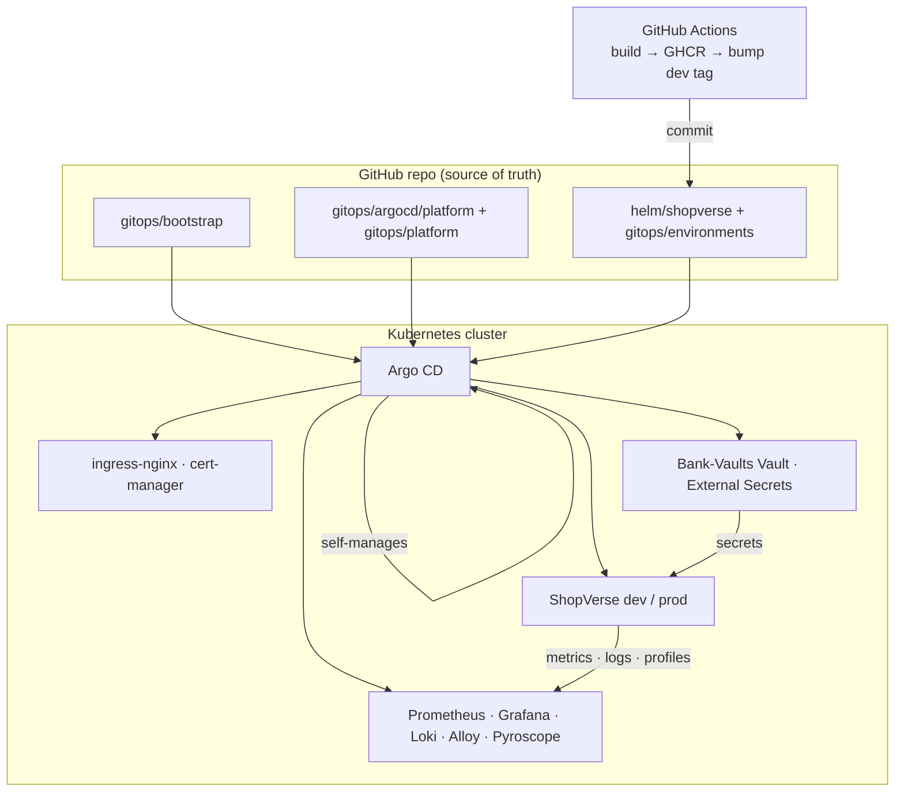

# ShopVerse: GitOps-Managed Microservices E-Commerce

ShopVerse is a Flipkart/Amazon-style shopping app built as microservices: a React storefront, an API gateway, five Node.js services and MongoDB. Everything runs on **Kubernetes**, is packaged with **Helm**, and is deployed by **Argo CD**. **Git is the single source of truth**, for the app and for the whole cluster platform around it.

```
 You change Git ──► Argo CD notices ──► the cluster converges to what Git says
 (PR / merge)        (polls / webhook)     (manual drift is reverted by selfHeal)
```

| What | Declared in Git as | Applied by |
|---|---|---|
| Argo CD itself (version, config, health checks) | `gitops/bootstrap/` (Kustomize) | Argo CD (manages itself) |
| Cluster platform: ingress-nginx, cert-manager, Vault, ESO, Prometheus/Grafana, Loki, Alloy, Pyroscope (MetalLB optional, for bare metal) | `gitops/argocd/platform/*.yaml` and `gitops/platform/` | Argo CD, in sync-wave order |
| Vault init, unseal, KV engine, auth methods, policies, roles | `gitops/platform/manifests/vault/vault.yaml` (Bank-Vaults `Vault` CR) | Bank-Vaults operator |
| Initial secret values (generated, **never stored in Git**) | `gitops/platform/manifests/secrets-seed/` (ESO generators and PushSecrets) | External Secrets Operator, which writes them to Vault once |
| The application (all 7 services and MongoDB) | `helm/shopverse/` and `gitops/environments/<env>/values.yaml` | Argo CD |
| Which version runs where | `global.imageTag` in each environment's values file | CI (dev) or a reviewed PR (prod) |

| Cloud infrastructure on GCP (GKE cluster, network, KMS key, static IP, CI identity, budget) | `infra/terraform/` | Terraform |

There is **no manual `helm install`, no `kubectl apply` of workloads and no setup script**. The only imperative step is the one-time bootstrap, which hands the cluster to Argo CD; on the GCP lab, `terraform apply` does it for you.

## Architecture



Application services:

| Service | Path | Responsibility | Database |
|---|---|---|---|
| `frontend` | `/` | React SPA served by unprivileged nginx | – |
| `api-gateway` | `/api/*` | Routing, rate limiting, CORS. Never exposes `/internal/*` | – |
| `user-service` | `/api/users` | Register/login (JWT), profile, addresses, admin seed | `shopverse_users` |
| `product-service` | `/api/products` | Catalog, search and filters, stock reserve/release | `shopverse_products` |
| `cart-service` | `/api/cart` | Per-user cart priced with live product data | `shopverse_carts` |
| `order-service` | `/api/orders` | Checkout saga (reserve stock, charge payment, save order, with compensation on failure) | `shopverse_orders` |
| `payment-service` | `/api/payments` | Mock payment processor. Card `4000 0000 0000 0002` is always declined | `shopverse_payments` |

The app also has customer and admin roles, an admin dashboard, Prometheus metrics, JSON logs and continuous profiling in every service. Containers run non-root with a read-only filesystem, and the namespaces enforce the `restricted` Pod Security Standard.

## Repository layout

```
gitops/
  bootstrap/                 Argo CD install (pinned upstream manifest + our config). Self-managed after bootstrap
  argocd/
    root-app.yaml            App-of-apps. The only Application you ever apply by hand
    project*.yaml            AppProjects: `platform` (cluster add-ons) and `shopverse` (app)
    platform/                One Application per platform component, ordered by sync wave
    apps/                    shopverse-dev, shopverse-prod
  platform/
    values/                  Helm values per platform component
    manifests/               Argo CD Ingress, ClusterIssuers, Vault CR + RBAC, ClusterSecretStore,
                             secret seeding, Grafana admin ExternalSecret
  environments/dev|prod/     App values per environment (image tag, hosts, scaling)
  optional/bare-metal/       MetalLB, for clusters without a cloud load balancer (not synced on GKE)
infra/terraform/             GCP: bootstrap (APIs, state, CI identity, budget) and lab (persistent + cluster)
scripts/                     argocd-bootstrap.sh (GitOps hand-off), lab-down.sh, lab-status.sh
helm/shopverse/              The application chart (+ Grafana dashboard JSON and its generator)
services/, frontend/         Source code. Each component has its own Dockerfile
.github/workflows/           CI: test, build and push to GHCR, bump dev tag, promote-to-prod PR
local-dev/                   Optional docker compose stack for developing on a laptop (not used for deployment)
renovate.json                Automated PRs for new chart, Argo CD and Vault versions
```

## How a change reaches the cluster

| You want to... | Do this in Git | What happens |
|---|---|---|
| Ship new code | Merge to `main` | CI builds and pushes `ghcr.io/shaggydesai/microservice-app/<svc>:sha-<commit>`, commits that tag to `gitops/environments/dev/values.yaml`, and Argo CD rolls out dev |
| Release to prod | Run **Actions → Promote to prod**, then review and merge the PR | The PR changes `gitops/environments/prod/values.yaml`. Merging it is the deployment |
| Roll back | `git revert` the tag-bump commit | Argo CD rolls back to the previous images |
| Scale, change resources or config | Edit `gitops/environments/<env>/values.yaml` | Argo CD applies the change |
| Upgrade Argo CD, cert-manager, Prometheus... | Merge the Renovate PR, or edit the version in `gitops/` | Argo CD upgrades the component (Argo CD upgrades itself too) |
| Change Vault config (policies, roles, engines) | Edit `gitops/platform/manifests/vault/vault.yaml` | Bank-Vaults applies the change to Vault |
| Add an environment | Copy `environments/dev`, `apps/shopverse-dev.yaml` and the seed block in `secrets-seed/seeds.yaml`, and add the namespace to `project.yaml` | Argo CD creates the namespace, secrets and app |

Changing a resource with `kubectl` doesn't stick: `selfHeal` reverts it to what Git says.

## Bootstrap a cluster (one time)

The reference setup is a GKE lab on GCP, created with Terraform. Step-by-step instructions, costs and teardown:
[`infra/terraform/bootstrap`](infra/terraform/bootstrap/README.md) (once per project) and
[`infra/terraform/envs/lab`](infra/terraform/envs/lab/README.md) (each session).

**Prerequisites:**
- The repository and the GHCR packages are **public**, so Argo CD and the kubelet need no credentials. For a private setup, add the repository and pull-secret credentials as Secrets labelled `argocd.argoproj.io/secret-type: repository`, the same way `gitops/bootstrap/repositories.yaml` does.
- The `gitops/` changes you want are merged to `main` (Argo CD deploys from `main`), and CI has pushed images for dev.
- `kubectl` and `gcloud` with `gke-gcloud-auth-plugin` on the machine that runs Terraform.

### 1. Create the cluster and hand it to Argo CD

```bash
cd infra/terraform/envs/lab/cluster
terraform plan -out=cluster.tfplan
terraform apply cluster.tfplan
```

After the cluster and node pool exist, Terraform runs [`scripts/argocd-bootstrap.sh`](scripts/argocd-bootstrap.sh) once
(`terraform_data.argocd_bootstrap`). The script:

```bash
kubectl apply -k gitops/bootstrap --server-side --force-conflicts   # installs Argo CD from Git (retried)
kubectl -n argocd rollout status ...                                # waits for Argo CD
kubectl apply -f gitops/argocd/root-app.yaml                        # app-of-apps: everything else comes from Git
```

From then on Argo CD owns everything in the cluster, Argo CD included; Terraform owns only the cloud resources.
Re-run the hand-off by hand with `make argocd-bootstrap`. On any other cluster (bare metal, kind, another cloud),
run the same three commands yourself and see [`gitops/optional/bare-metal`](gitops/optional/bare-metal/README.md).

### 2. Watch it converge (about 10–15 minutes)

```bash
kubectl -n argocd get applications -w
```

Argo CD syncs the Applications wave by wave. Each wave waits until the previous one is **Healthy** (the health checks are declared in `gitops/bootstrap/argocd-cm.yaml`):

| Wave | Application | What it does |
|---|---|---|
| -50 | AppProjects `platform`, `shopverse` | Must exist before any Application that references them |
| -40 | `argocd` | Argo CD starts managing itself from `gitops/bootstrap` |
| -30 | `prometheus-operator-crds` | Monitoring CRDs, so later charts can ship ServiceMonitors |
| -27, -26 | `cert-manager`, `cert-manager-config` | Let's Encrypt issuers and a private CA (`shopverse-ca-issuer`) |
| -25 | `ingress-nginx` | One Google Cloud load balancer on the reserved static IP `8.234.83.188` |
| -24 | `argocd-ingress` | The Argo CD UI Ingress and its certificate (kept out of `gitops/bootstrap`, since an Ingress is only Healthy once ingress-nginx exists) |
| -24, -23 | `vault-operator`, `vault` | Bank-Vaults creates Vault, **initialises it and auto-unseals it with Cloud KMS**, then applies the KV engine, Kubernetes auth, policy and role from the CR |
| -22, -21 | `external-secrets`, `external-secrets-config` | ESO and the `vault-backend` ClusterSecretStore |
| -20 | `secrets-seed` | Generates random app and Grafana secrets in-cluster and pushes them into Vault (once) |
| -19 | `monitoring-config` | Grafana admin credentials pulled from Vault |
| -18, -17 | `kube-prometheus-stack`, `loki`, `pyroscope`, `alloy` | Metrics, dashboards, alerts, logs and profiles |
| 0 | `shopverse-dev`, `shopverse-prod` | The app. Its secrets come from Vault through ExternalSecrets |

### 3. Open the UIs

No DNS setup is needed: [sslip.io](https://sslip.io) resolves `<anything>.8-234-83-188.sslip.io` to `8.234.83.188`.
cert-manager gets a Let's Encrypt certificate for each host (HTTP-01), so browsers trust them.

| UI | URL | Login |
|---|---|---|
| Storefront (dev) | https://shop-dev.8-234-83-188.sslip.io | `admin@shopverse.local` + `kubectl -n shopverse-dev get secret shopverse-secrets -o jsonpath='{.data.admin-password}' \| base64 -d` |
| Storefront (prod) | https://shop.8-234-83-188.sslip.io | `admin@shopverse.local` + the same command in `shopverse-prod` |
| Argo CD | https://argocd.8-234-83-188.sslip.io | `admin` + `kubectl -n argocd get secret argocd-initial-admin-secret -o jsonpath='{.data.password}' \| base64 -d` |
| Grafana | https://grafana.8-234-83-188.sslip.io | `admin` + `kubectl -n monitoring get secret grafana-admin -o jsonpath='{.data.admin-password}' \| base64 -d` |
| Prometheus | https://prometheus.8-234-83-188.sslip.io | – |
| Vault | https://vault.8-234-83-188.sslip.io | Root token (see below) |

Vault's root token is stored encrypted in the unseal bucket. Decrypt it with the KMS key:

```bash
gcloud storage cat gs://vault-unseal-684852499708/vault-root |
  gcloud kms decrypt --project shopverse-lab --location asia-south1 --keyring shopverse-vault --key vault-unseal \
    --ciphertext-file=- --plaintext-file=-; echo
```

If that returns `PERMISSION_DENIED`, your account lacks `cloudkms.cryptoKeyVersions.useToDecrypt` on the key
(Terraform granted it only to `vault-unseal@`); grant yourself `roles/cloudkms.cryptoKeyDecrypter` on that key.

**If a certificate stays not Ready:** sslip.io isn't on the Public Suffix List, so Let's Encrypt's limit of 50
certificates per registered domain per week is shared by every sslip.io user. Check with
`kubectl get certificate -A` and `kubectl describe order -A`; on `rateLimited`, change the
`cert-manager.io/cluster-issuer` annotations to `letsencrypt-staging` (untrusted, but proves the flow) or
`shopverse-ca-issuer`, or use your own domain. Each is a one-line Git change per Ingress.

## Secrets: Vault as the source of truth, with no values in Git

```
Password generator ─► ExternalSecret (refreshPolicy: CreatedOnce) ─► PushSecret (updatePolicy: IfNotExists) ─► Vault KV
                                                                                                              │
          Pods ◄── Secret "shopverse-secrets" ◄── ExternalSecret (Helm chart, refresh 1h) ◄── ClusterSecretStore ┘
```

- **Vault** runs with integrated (raft) storage. The Bank-Vaults operator initialises and unseals it, and keeps re-applying `externalConfig` from Git: the KV v2 engine, Kubernetes auth, and the `external-secrets` policy and role.
- **Initial values** are generated in-cluster (32 random characters each) and written to Vault only if the key doesn't already exist. Vault stays authoritative after that: re-syncing never overwrites a value.
- **Rotating** a value is a change to the secret data, not to configuration, so it happens in Vault: `vault kv patch secret/shopverse/prod jwt-secret=<new>`. ESO syncs it within an hour (annotate the ExternalSecret with `force-sync=$(date +%s)` to sync now), then run `kubectl rollout restart deploy -n shopverse-prod`.
- **Auto-unseal with Cloud KMS:** Bank-Vaults encrypts the unseal keys and root token with the `vault-unseal` KMS key and stores them in the `vault-unseal-<project-number>` bucket. The Vault pods reach both through Workload Identity (`vault/vault` → `vault-unseal@`), so there are no key files and nothing sensitive in Kubernetes Secrets. Without a cloud KMS, `unsealConfig.kubernetes` keeps them in a Secret instead (see the comment in `vault.yaml`).

## Observability

| Signal | How it's collected | Where to look |
|---|---|---|
| Metrics | Each service serves `/metrics` (RED metrics, Node.js runtime, business KPIs). The chart's ServiceMonitor gets them scraped | Grafana **ShopVerse / Overview** dashboard |
| Alerts | The chart's PrometheusRule: service down, MongoDB disconnected, 5xx ratio > 5%, p95 > 1s, checkout errors, payment decline rate > 30% | Alertmanager (add receivers in `values/kube-prometheus-stack.yaml`) |
| Logs | JSON on stdout. Alloy (DaemonSet) labels each line with `namespace`, `app` and `level` and ships it to Loki | Dashboard logs row, or Explore with `{app="order-service"} \| json` |
| Profiles | `@pyroscope/nodejs` pushes wall-time and heap profiles as `shopverse.<service>` | Dashboard flame graph, or Explore → Profiles |

Custom metrics: `shopverse_orders_placed_total`, `shopverse_revenue_inr_total`, `shopverse_order_value_inr`, `shopverse_checkout_failures_total{reason}`, `shopverse_payments_total{method,status}`, `shopverse_users_registered_total`, `shopverse_user_logins_total{result}`, `shopverse_cart_items_added_total`, `shopverse_stock_reservation_conflicts_total`, plus `http_request_duration_seconds{service,method,route,status_code}`.

The dashboard JSON is generated: edit `helm/shopverse/dashboards/generate.py`, then re-run it.

## Pinned versions

These versions were checked against the upstream chart indexes and rendered with this repo's values. Renovate opens grouped PRs when new versions come out (enable the Renovate GitHub App on the repo).

| Component | Version | Component | Version |
|---|---|---|---|
| Argo CD | v3.5.3 | kube-prometheus-stack | 91.9.0 (Prometheus v3.15, Grafana 13.2) |
| MetalLB (optional) | 0.16.1 | prometheus-operator-crds | 32.0.1 |
| cert-manager | v1.21.2 | Loki | 7.3.0 (Loki 3.6) |
| ingress-nginx | 4.15.1 | Alloy | 1.13.0 (Alloy v1.20) |
| Bank-Vaults operator | 1.24.1 (Vault 2.0.1) | Pyroscope | 2.3.1 |
| External Secrets | 2.11.0 (`external-secrets.io/v1`) | | |

> **ingress-nginx** is retired upstream (best-effort maintenance ended in March 2026), so 4.15.1 is its final release. It works, but plan a move to a maintained controller or to the Gateway API. Only `ingress.className`, the ingress-nginx app and the cert-manager HTTP-01 solver would need to change.

## CI/CD

`.github/workflows/ci.yaml` runs on every PR and every push to `main`:

1. Installs and syntax-checks the services, builds the frontend, then lints and renders the Helm chart for each environment.
2. Renders the Argo CD bootstrap with Kustomize. Validates every manifest (app, platform and Argo CD) against the Kubernetes and CRD schemas with kubeconform, and checks the alert rules with `promtool`.
3. On `main`, builds the 7 images (linux/amd64) and pushes them to GHCR, then commits the new tag to the dev environment (the GitOps step).

`.github/workflows/promote.yaml` checks that the images exist, then opens the prod promotion PR. For it to work, enable **Settings → Actions → Allow GitHub Actions to create pull requests**. If `main` is protected, let `github-actions[bot]` push the dev tag bump.

## Helm chart reference

Main keys in `helm/shopverse/values.yaml`:

| Key | Purpose |
|---|---|
| `global.imageRegistry` / `global.imageTag` | Image location and tag for all services |
| `services.<name>.*` | Per-service tag, replicas, resources, env |
| `serviceDefaults.*` | Replicas, resources, HPA and PDB for every service |
| `externalSecret.*` | Vault-backed secrets via ESO: `remoteKey: shopverse/<env>` |
| `secrets.create` | Plain chart-managed secrets (only for clusters without Vault) |
| `monitoring.serviceMonitor`, `.prometheusRule`, `.dashboards` | Observability integration |
| `profiling.enabled` | Push profiles to Pyroscope |
| `mongodb.*` | In-cluster MongoDB StatefulSet, or `external.host` for a managed one |
| `ingress.*`, `networkPolicy.*` | Exposure and isolation |

## Local development (optional)

`local-dev/docker-compose.yml` runs the same images on a laptop, for coding and debugging only. It plays no part in deployment.

```bash
docker compose -f local-dev/docker-compose.yml up --build                       # http://localhost:3000
PYROSCOPE_SERVER_ADDRESS=http://pyroscope:4040 \
  docker compose -f local-dev/docker-compose.yml --profile observability up --build   # + Grafana on :3001
```

The observability profile uses the same Prometheus, Grafana, Loki, Alloy and Pyroscope versions as the cluster, and the same dashboard.

## API quick reference

All endpoints are under `/api`. Endpoints marked 🔒 need `Authorization: Bearer <token>`.

| Method | Path | Notes |
|---|---|---|
| POST | `/users/register`, `/users/login` | Returns `{ token, user }` |
| GET/PUT | `/users/me` 🔒 | Profile |
| POST/DELETE | `/users/me/addresses[/:id]` 🔒 | Saved addresses |
| GET | `/products?q=&category=&brand=&minPrice=&maxPrice=&sort=&page=&limit=` | `sort`: relevance, price-asc, price-desc, rating, newest |
| GET | `/products/categories`, `/products/brands`, `/products/:id` | `:id` can be an id or a slug |
| POST/PUT/DELETE | `/products[/:id]` 🔒 admin | Manage catalog |
| GET/DELETE | `/cart` 🔒 | Cart with price summary |
| POST | `/cart/items` 🔒 | `{ productId, quantity }` |
| PATCH/DELETE | `/cart/items/:productId` 🔒 | Update quantity or remove |
| POST | `/orders` 🔒 | `{ shippingAddress, paymentMethod: UPI\|CARD\|NETBANKING\|COD, paymentDetails }` |
| GET | `/orders`, `/orders/:orderNumber` 🔒 | History and detail |
| POST | `/orders/:orderNumber/cancel` 🔒 | Releases stock and refunds the payment |
| GET | `/orders/admin/all` 🔒 admin | All orders |
| PATCH | `/orders/:orderNumber/status` 🔒 admin | `PACKED → SHIPPED → OUT_FOR_DELIVERY → DELIVERED` |
| GET | `/payments` 🔒 | Payment history |

Every service exposes `/healthz` (liveness) and `/readyz` (MongoDB connected).

## Configuration (environment variables)

| Variable | Used by | Description |
|---|---|---|
| `MONGO_URI` | all domain services | MongoDB connection string |
| `JWT_SECRET` | all domain services | Signs and verifies user tokens |
| `INTERNAL_TOKEN` | all domain services | Shared secret for `/internal/*` calls |
| `*_SERVICE_URL` | gateway, cart, order | Upstream service URLs |
| `ADMIN_EMAIL` / `ADMIN_PASSWORD` | user-service | Bootstrap admin account |
| `SEED_DATA` | product-service | Seed the demo catalog when the database is empty (default `true`) |
| `FREE_DELIVERY_ABOVE` / `DELIVERY_FEE` | order-service | Delivery pricing |
| `RATE_LIMIT_PER_MINUTE` / `CORS_ORIGINS` | api-gateway | Edge controls |
| `API_GATEWAY_URL` / `NGINX_RESOLVER` | frontend | Where nginx proxies `/api` |
| `PYROSCOPE_SERVER_ADDRESS` | all backend services | Enables continuous profiling (unset = off) |

> `services/*/src/lib.js` is shared helper code. It is copied into every service on purpose, so each image builds from its own folder. If you change it, change all the copies.
